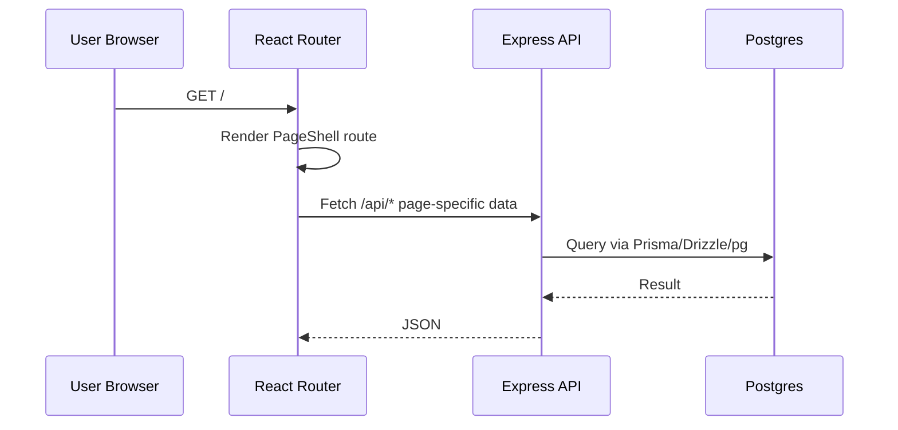
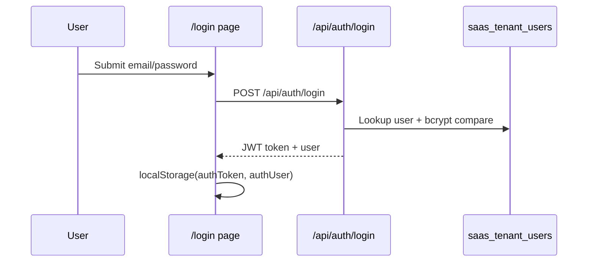
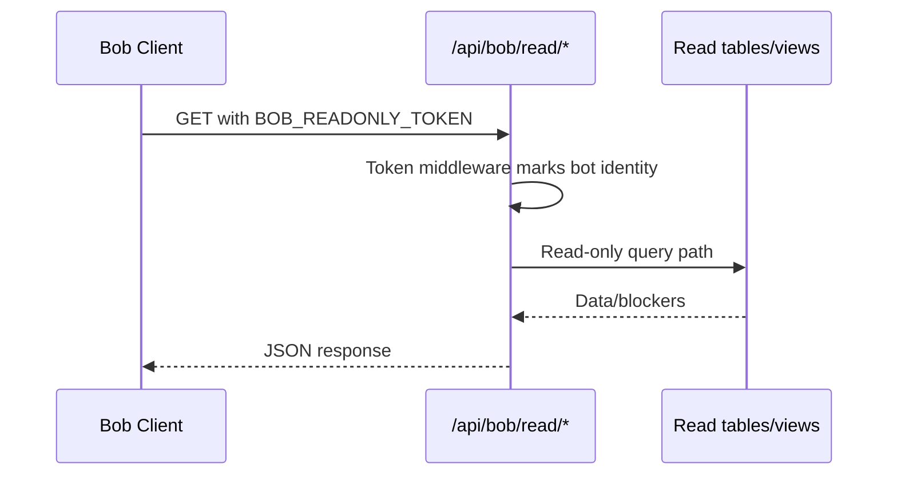

# Data Flow Map

## Public homepage / dashboard load

```mermaid
sequenceDiagram
  participant U as User Browser
  participant FE as React Router
  participant BE as Express API
  participant DB as Postgres
  U->>FE: GET /
  FE->>FE: Render PageShell route
  FE->>BE: Fetch /api/* page-specific data
  BE->>DB: Query via Prisma/Drizzle/pg
  DB-->>BE: Result
  BE-->>FE: JSON
```

## Auth login flow

```mermaid
sequenceDiagram
  participant U as User
  participant FE as /login page
  participant BE as /api/auth/login
  participant DB as saas_tenant_users
  U->>FE: Submit email/password
  FE->>BE: POST /api/auth/login
  BE->>DB: Lookup user + bcrypt compare
  BE-->>FE: JWT token + user
  FE->>FE: localStorage(authToken, authUser)
```

## Bob read-only flow

```mermaid
sequenceDiagram
  participant C as Bob Client
  participant BE as /api/bob/read/*
  participant DB as Read tables/views
  C->>BE: GET with BOB_READONLY_TOKEN
  BE->>BE: Token middleware marks bot identity
  BE->>DB: Read-only query path
  DB-->>BE: Data/blockers
  BE-->>C: JSON response
```
